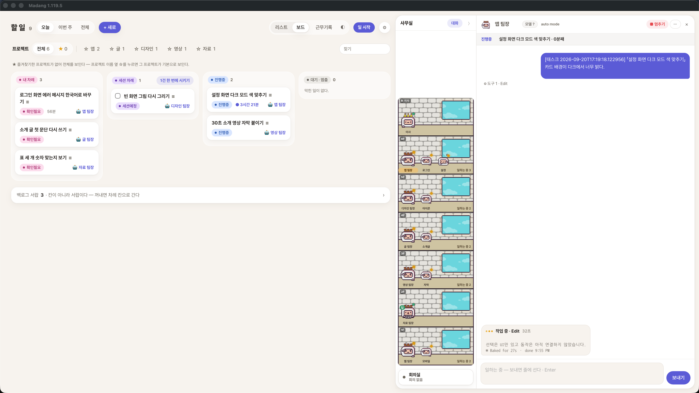

# Madang

> a desk for your Claude Code & Codex sessions

여러 폴더에서 돌아가는 **Claude Code**와 **Codex** 세션을 한 화면에 모아 보고, 할 일을 적어 바로 시키는 macOS 앱입니다.

<!-- 확인 필요: 대표 이미지 / 시연 GIF — 촬영 뒤 docs/shots/ 에 넣는다 -->


터미널 탭을 하나씩 눌러 가며 「어느 세션이 끝났지, 어느 세션이 승인을 기다리며 멈춰 있지」를 확인하던 일을 없애려고 만들었습니다.
세션은 사무실에 앉은 캐릭터로 보이고, 할 일은 리스트·보드로 정리되며, 할 일을 그 폴더의 세션에게 곧바로 시킬 수 있습니다.

## 무엇을 하나요

| | |
|---|---|
| **본다** | 폴더마다 도는 세션이 사무실의 캐릭터로 앉습니다. 생각 중 · 작업 중 · 승인 대기 · 완료가 한눈에 보입니다 |
| **주고받는다** | 대화 칸에서 세션이 한 말을 읽고, 말을 보내고, 승인창·선택창을 버튼으로 고릅니다 |
| **적고 시킨다** | 할 일을 리스트·보드로 관리하고, 「시키기」를 누르면 그 폴더의 세션이 받아 갑니다. 세션도 스스로 할 일을 만들고, 시작·멈춤 시간을 남깁니다 |
| **모은다** | 회의실에서 세션 여럿을 한 주제로 모아 라운드 토론을 시키고, 결론 밑에 내 의견을 달아 다음 라운드로 넘기거나 끝냅니다. 결론은 문서로 남습니다 |
| **챙긴다** | 남은 사용 한도, 세션별로 쓴 토큰, 폰에서 보기(같은 와이파이·Tailscale) |

<!-- 확인 필요: 스크린샷 4장 — 보드 · 대화 칸 선택 카드 · 리스트 · 처음 설정 -->

## 무엇이 아닌가요

- **터미널 앱이 아닙니다.** 세션의 주인은 tmux이고, Madang은 tmux를 부르는 얇은 껍데기입니다. 앱을 꺼도 세션은 살아 있고 `tmux attach`로 그대로 붙을 수 있습니다.
- **클라우드 서비스가 아닙니다.** 서버도 계정도 없습니다. 모든 기록은 이 맥 안에만 저장됩니다.
- **macOS 전용입니다.** 애플 실리콘(arm64), macOS 12 이상에서 동작합니다. Windows는 준비 중입니다.

## 설치

### 1. 준비물

아래 둘 중 **하나 이상**이 필요합니다. 둘 다 써도 됩니다.

- [Claude Code](https://code.claude.com/docs/en/overview) — 설치 후 터미널에서 `claude`를 한 번 실행해 로그인합니다
- [Codex CLI](https://developers.openai.com/codex/cli) — 설치 후 터미널에서 `codex`를 한 번 실행해 로그인합니다

tmux(세션을 띄우는 도구)는 **앱에 들어 있어 따로 설치하지 않아도 됩니다.** 둘 다 없어도 앱의 「처음 설정」 창에서 설치 버튼으로 깔 수 있습니다.

### 2. 앱 받기

1. [Releases](<!-- 확인 필요: 저장소 주소 -->)에서 `Madang-<버전>-macos-arm64.dmg`를 받습니다
2. DMG를 열고 **Madang을 「응용 프로그램」 폴더로 끌어 놓습니다**
3. 응용 프로그램 폴더에서 Madang을 엽니다

애플 공증을 받은 앱이라 「확인되지 않은 개발자」 경고 없이 열립니다. 처음 열 때 macOS가 「인터넷에서 받은 앱을 열까요?」라고 한 번 묻는 것은 모든 앱에 공통입니다.

<!-- 확인 필요: DMG 창 캡처 -->

### 3. 처음 설정

앱을 열면 **「처음 설정」** 창이 뜹니다. 맨 위 **「쓰는 에이전트」**에서 Claude Code · Codex 중 쓰는 것을 고르면(둘 다 가능) 고른 것만 점검합니다. 모든 줄이 ✓가 되면 끝입니다.

| 줄 | 할 일 |
|---|---|
| tmux · git | 없으면 설치 버튼이나 표시된 명령으로 깔고 「다시 보기」 |
| Claude Code · 로그인 | **「Claude Code 설치하기」** 한 번 → 터미널에서 `claude auth login` |
| **훅 연결** (Claude) | **「훅 연결하기」** 한 번. `~/.claude/settings.json`에 세션 상태를 Madang(127.0.0.1)으로 알리는 줄을 덧붙입니다. 먼저 백업을 남기고, 원래 있던 훅은 건드리지 않으며, 「훅 빼기」로 언제든 되돌립니다 |
| Codex · Codex 로그인 | **「Codex 설치하기」** 한 번 → 터미널에서 `codex`를 켜서 로그인 |
| **Codex 훅 연결** | **「Codex 훅 연결하기」** 한 번 → `~/.codex/hooks.json`에 같은 줄을 덧붙입니다. **Codex는 새 훅을 직접 신뢰해야 돕니다** — 코덱스 안에서 `/hooks`를 열고 `t`(전부 신뢰)를 누릅니다 |
| **지켜볼 폴더** | 쓰던 프로젝트가 있으면 **「폴더 고르기」**, 처음이면 **「새 폴더 만들기」** |
| 회의 명령 (선택) | 회의실을 쓰려면 **「회의 명령 넣기」** — `~/.claude/commands/회의.md`를 만듭니다(Claude Code 전용) |

「새 폴더 만들기」는 폴더와 함께 시작용 `CLAUDE.md`(Codex를 고르면 `AGENTS.md`도)를 만들고, **「이 폴더에서 Claude 켜기 / Codex 켜기」**를 누르면 세션이 먼저 「무엇을 도와드릴까요?」라고 묻습니다. 답한 내용은 그 파일에 정리되고, 이 파일에는 세션이 Madang의 할 일을 쓰는 규칙도 들어 있습니다.

창을 닫았다면 ⚙ → **처음 설정**으로 다시 엽니다. 이미 켜 두었던 세션은 한 번 다시 켜야 훅이 붙습니다.

## 쓰는 법

- **사무실** — 오른쪽 판에 등록한 폴더의 세션이 앉습니다. 캐릭터를 누르면 그 세션의 대화가 열립니다
- **대화 칸** — 보내기(Enter) · 줄바꿈(Shift+Enter) · `/` 명령 목록 · `@` 파일 · 그림 붙여넣기. 승인창이 뜨면 선택 카드로 고릅니다. 머리의 **「＋ 하위」**로 그 폴더 안에 하위 세션을 만들거나 고릅니다
- **할 일** — 「+ 새로」로 적고, 「세션 차례」로 두면 **시키기**로 그 폴더의 세션에 보냅니다. 끝나면 「확인필요」로 돌아오고, 고칠 것이 있으면 카드에서 바로 「수정요청」을 보냅니다
- **폰으로 보기** — ⚙ → 폰으로 보기 → QR. 같은 와이파이, 또는 맥과 폰 모두 [Tailscale](https://tailscale.com)에 붙어 있어야 합니다. 주소에 열쇠가 들어 있으니 다른 사람에게 보내지 마세요
- **출근·퇴근** — 꺼진 세션은 대화 칸 머리의 **「▶ 출근시키기」**(쓰는 에이전트가 둘이면 「Claude로 / Codex로 출근」)로 켜고, **「퇴근」**으로 내립니다
- **회의실** — 사무실 맨 아래 **「회의실」** → 회의 시작. 모을 세션을 고르고(퇴근한 세션은 누르면 출근시킵니다) 주제를 적으면, 가장 바깥 폴더의 세션이 진행자가 되어 라운드를 돌립니다. 진행자도 의견을 내므로 참석자 한 명과 1:1로도 됩니다. 라운드가 끝나면 결론 밑 의견 칸에 적어 **「다음 회의 이어가기」** 또는 **「회의 끝내기」**를 누릅니다. 끝난 회의의 `결론.md`는 대화 칸·사무실 얼굴로 끌어다 세션에 넘길 수 있습니다
  회의는 Claude Code의 [세션 간 메시지](https://code.claude.com/docs/en/cross-session-messaging) 기능을 씁니다.
  - 처음 설정의 **「회의 명령 넣기」**가 먼저 필요합니다. Claude Code **v2.1.224 이상**(`claude --version`)
  - 참석할 세션이 **같은 맥에서 대화형으로** 떠 있어야 합니다. 일하는 중인 세션은 회의를 시작할 때 막힙니다(답을 끝낸 뒤 다시)
  - 승인 생략(아래)으로 켠 세션은 보통 세션이 보낸 메시지를 승인 창에 붙잡아 둡니다. 회의에 부를 세션들은 같은 방식으로 켜 두는 편이 매끄럽습니다

### Codex로 쓸 때

Codex 세션도 사무실에 캐릭터로 앉고(이름 옆 **Codex** 꼬리표) 상태 · 승인 대기 선택 카드 · 보내기 · 할 일 시키기와 시간 기록이 됩니다.
아직 안 되는 것은 **회의 참석 · 남은 한도 · 토큰 사용량**(Claude Code 전용)이고, 대화 칸에는 턴이 끝날 때의 마지막 답만 올라옵니다.

### 승인창에 대하여

기본은 **도구 승인을 하나하나 묻는 쪽**입니다. Madang이 띄우는 세션에서 승인을 생략하려면 표식 파일을 직접 만들어야 하고, 이미 떠 있는 세션에는 적용되지 않습니다. **내 코드만 여는 폴더에서만** 켜세요.

```bash
mkdir -p ~/Library/Application\ Support/madang && touch ~/Library/Application\ Support/madang/yolo   # 켜기
rm ~/Library/Application\ Support/madang/yolo                                                        # 끄기
```

### 숨길 폴더

화면에 올라오면 안 되는 폴더(가계부·계약서 등)는 `~/Library/Application Support/madang/blocked_paths.json`에 적습니다. 모양은 [`blocked_paths.example.json`](blocked_paths.example.json)에 있습니다. 적은 폴더에서 온 신호는 통째로 무시됩니다.

## 개인정보와 보안

- 모든 데이터(할 일 · 대화 · 설정)는 이 맥의 `~/Library/Application Support/madang` 안에만 저장되고, 밖으로 보내지 않습니다
- 훅을 받는 포트(`127.0.0.1:9876`)는 이 맥 안에서만 열리며 **인증이 없습니다.** 같은 맥의 다른 프로그램이 신호를 흉내 낼 수 있다는 뜻입니다
- 폰으로 보기(`0.0.0.0:9878`)는 열쇠가 있어야 열리지만 평문 HTTP입니다. **공유기 포트를 열어 인터넷에 내놓지 마세요.** 카페 와이파이에서도 쓰지 않습니다

## 소스에서 빌드하기 (개발자용)

[Flutter](https://docs.flutter.dev/get-started/install/macos) 3.41 이상과 Xcode가 필요합니다.

```bash
git clone <!-- 확인 필요: 저장소 주소 -->
cd madang
python3 scripts/setup.py        # 준비물 확인 → 빌드 → ~/Applications/Madang 설치 → 앱 열기
```

손으로 하려면:

```bash
flutter pub get
flutter test
flutter build macos --release
python3 scripts/install.py --run
```

소스에서 빌드해 `~/Applications/Madang`(앱 옆에 `art/`가 있는 모양)으로 설치하면 설정·데이터는 `~/Library/Application Support/madang`이 아니라 **그 폴더 안**에 저장됩니다.

소스 빌드는 애드혹 서명이라, 다시 빌드할 때마다 화면 기록 같은 권한이 풀릴 수 있습니다. 자기 애플 개발자 인증서가 있다면 `macos/Runner.xcodeproj`의 Release 서명을 바꿔 쓰세요.

### 어떻게 돌아가나요

```
폴더마다 tmux 세션에서 도는 claude · codex
   │  훅 (POST)                    ▲  send-keys (보내는 말)
   ▼                               │
127.0.0.1:9876 ──▶ Madang ─────────┘
                    │  capture-pane (지금 화면)
                    └──────────────▶
```

세 갈래를 섞지 않는 것이 뼈대입니다 — **상태는 훅으로**, **화면 읽기는 capture-pane으로**, **입력은 send-keys로**.

더 자세한 설계 원칙과 검증 방법은 [`CLAUDE.md`](CLAUDE.md)에, 그림 규격은 [`art/README.md`](art/README.md)에 있습니다.

## 라이선스

MIT — [`LICENSE`](LICENSE). 함께 들어 있는 픽셀 그림도 같은 라이선스를 따릅니다.
배포 앱에 들어 있는 [tmux](https://github.com/tmux/tmux)(ISC)·[libevent](https://libevent.org)(BSD)·[utf8proc](https://github.com/JuliaStrings/utf8proc)(MIT)의 라이선스는 앱의 `Contents/Resources/ThirdParty/`에 있습니다.

Made by [MUWIDARANI](<!-- 확인 필요: 홈페이지 주소 -->)
